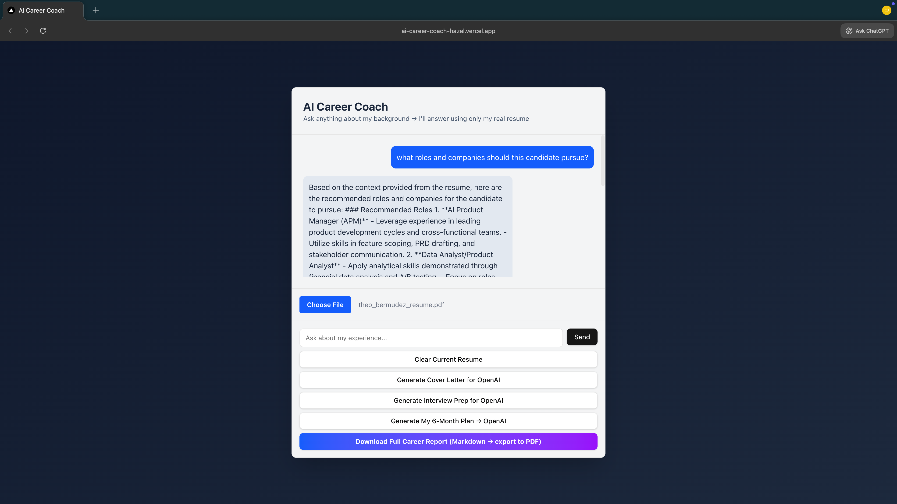

# AI Career Coach

RAG-powered career coaching app that grounds responses in your actual resume — not generic advice.

**[Live Demo](https://ai-career-coach-hazel.vercel.app)** | **[LinkedIn](https://linkedin.com/in/theobermudez)**



## What it does

Upload your resume PDF → ask questions → get answers grounded in YOUR experience, with specific metrics and dates pulled from your actual background.

## Tech Stack

- **Frontend:** Next.js 16, React, Tailwind CSS, shadcn/ui
- **Vector DB:** Supabase with pgvector (1536 dimensions)
- **Embeddings:** OpenAI text-embedding-3-small
- **LLM:** OpenAI GPT-4o-mini
- **Orchestration:** LangGraph multi-agent pipeline
- **Analytics:** PostHog

## Architecture
```
PDF Upload → pdf-parse → Chunking (800/200) → Embeddings → Supabase pgvector
                                                              ↓
User Query → Embed Query → Cosine Similarity Search → Top-K Chunks
                                                              ↓
                                              Grounded LLM Response
```

## Key Features

- **Grounded responses:** Uses RAG to ensure answers come from your resume, not hallucinations
- **Multi-agent reports:** Cover letter, interview prep, gap analysis, 6-month plan
- **Anti-hallucination prompts:** Explicit grounding rules prevent generic fluff

## Run Locally
```bash
git clone https://github.com/Theo-ai-lab/ai-career-coach.git
cd ai-career-coach
npm install
cp .env.example .env.local  # Add your API keys
npm run dev
```

## Why I Built This

I wanted to demonstrate production-level RAG implementation — not just a tutorial, but a deployed app with real grounding, chunking strategies, and multi-agent orchestration. Built as part of my portfolio for AI APM roles.

## What I Learned

- Chunking strategy matters: 800 tokens with 200 overlap balances context vs. precision
- Grounding prompts need explicit rules ("ONLY use context provided")
- pgvector HNSW indexes are fast enough for real-time UX
- Multi-agent LangGraph requires careful state management

---

*Built by [Theo Bermudez](https://linkedin.com/in/theobermudez)*
