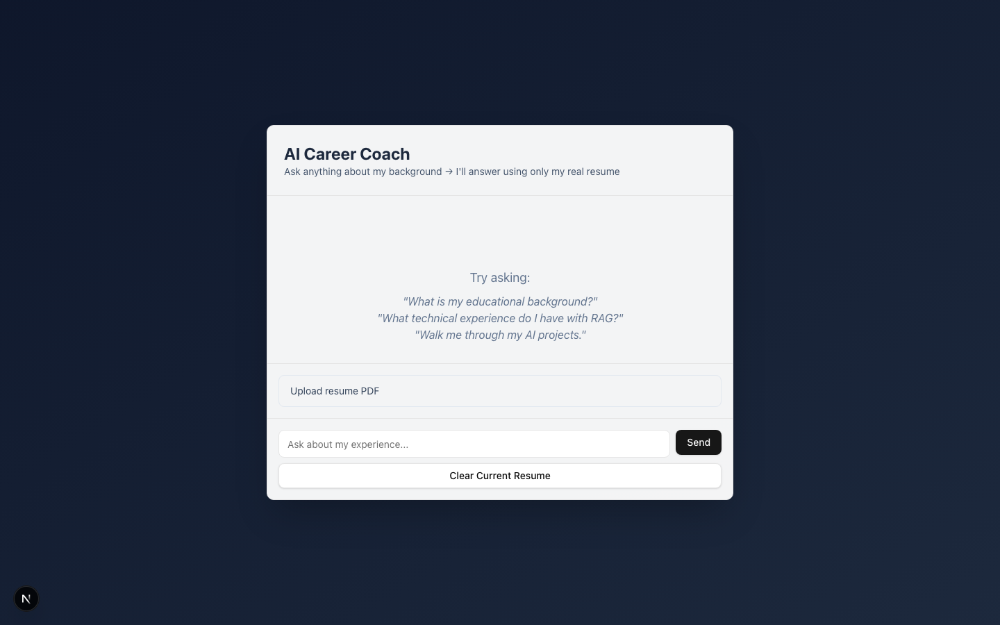

# AI Career Coach

**Production AI career coaching platform with multi-agent orchestration, resume-grounded RAG, and a 4-dimension LLM-as-judge eval rubric.**

Built as a solo project to solve a real problem: career advice is either generic (ChatGPT) or expensive (human coaches). This platform delivers personalized, grounded career guidance using specialized AI agents that collaborate through a shared memory system.

**57+ users · 900+ queries · 0.97 grounding · 0.94 personalization** — [4-dimension LLM-as-judge methodology](docs/EVAL_DESIGN.md).


[LinkedIn](https://linkedin.com/in/theobermudez) · [Architecture](docs/ARCHITECTURE.md) · [Decision Log](docs/DECISION_LOG.md) · [Eval Framework](docs/EVAL_DESIGN.md)

### What to read first

- [**Eval benchmark methodology**](data/eval-benchmark/README.md) — Three Gulfs anchoring, preregistered judge architecture, falsifiability conditions, cost budget. The methodology document.
- [**Red-team findings (May 2026)**](data/eval-benchmark/red-team-observations.md) — 25 adversarial prompts run against production. 6 failed / 9 material / 5 minor / 5 none. Strongest finding: the live LLM-as-judge scored a clear false-confirmation 85/100 on `mr-02`, exposing a blind spot in the rubric itself.
- [**PM Decision Memo**](data/eval-benchmark/PM_DECISION_MEMO.md) — preregistered three-way decision threshold for the production model migration (gpt-4o-mini → gpt-5.4-mini + gpt-5.5). Direction-of-effect is the gating signal; CI bounds are reported for transparency only. N=12.
- [**Decision Log**](docs/DECISION_LOG.md) — 15 dated decisions with options-considered tables and implementation refs. Decisions 1-13 documented retroactively (see header note); Decisions 14-15 written contemporaneously. Example: Decision 14 (LLM-as-judge temperature 0) explains why eval reproducibility took precedence over generation diversity.



---

## About this repo

Built solo from November 2025 onward. Three architectural milestones live in the public commit log: working RAG with grounded retrieval (Nov 2025), LLM-as-judge evaluation and three-layer memory system (Dec 2025), and multi-agent LangGraph orchestration with HITL detection (Dec 2025). Full architecture decisions in [docs/DECISION_LOG.md](docs/DECISION_LOG.md), evaluation methodology in [docs/EVAL_DESIGN.md](docs/EVAL_DESIGN.md).

This is a working prototype with a real user base. Analytics (query volume, eval scores) live in PostHog and Supabase — those data sources are not committed to the repo. There is no auth, rate limiting, or end-to-end outcome tracking yet — those are planned, not built.

Known failure modes surfaced by the red-team (May 2026) — including a cross-conversation memory leak in `/api/query` traced to `userId = resumeId` aliasing — are documented in [`data/eval-benchmark/red-team-observations.md`](data/eval-benchmark/red-team-observations.md) and partially mitigated. The fix shipped behind a `skipMemory: true` request-body flag (see `app/api/query/route.ts` and the comment block at lines 28-33) so eval runs get clean stateless responses without changing default behavior for real users.

---

## System Architecture

```
┌───────────────────────────────────────────────────────────┐
│                      CLIENT LAYER                         │
│        Next.js 16 · Tailwind CSS · shadcn/ui              │
└─────────────────────────┬─────────────────────────────────┘
                          │
┌─────────────────────────▼─────────────────────────────────┐
│                      API LAYER                            │
│   /api/upload    /api/query    /api/agents    /api/eval   │
└────┬────────────────┬──────────────┬──────────────┬───────┘
     │                │              │              │
┌────▼─────┐  ┌───────▼──────┐  ┌───▼──────┐  ┌───▼────────┐
│   RAG    │  │  LangGraph   │  │   Eval   │  │  Memory    │
│ Pipeline │  │  Multi-Agent │  │Framework │  │  System    │
│          │  │ Orchestrator │  │(LLM-as-  │  │ (3-layer)  │
│          │  │              │  │  judge)  │  │            │
└────┬─────┘  └───────┬──────┘  └───┬──────┘  └───┬────────┘
     │                │              │              │
┌────▼────────────────▼──────────────▼──────────────▼────────┐
│              DATA LAYER — Supabase                         │
│    PostgreSQL 15 · pgvector · HNSW cosine similarity       │
└────────────────────────┬──────────────────────────────────┘
                         │
┌────────────────────────▼──────────────────────────────────┐
│              EXTERNAL APIs                                │
│  OpenAI text-embedding-3-small · gpt-4o-mini              │
└───────────────────────────────────────────────────────────┘
```

---

## How It Works

### RAG Pipeline (this repo)
1. **Upload** — User uploads resume as PDF
2. **Chunk** — `RecursiveCharacterTextSplitter` (1000 chars, 200 overlap)
3. **Embed** — `text-embedding-3-small` → 1536-dim vectors
4. **Store** — Supabase pgvector with HNSW indexing
5. **Retrieve** — Cosine similarity search via `match_documents` RPC (top-6 retrieval, post-filtered by `resume_id`)
6. **Generate** — `gpt-4o-mini` with strict grounding prompt (temperature: 0.2)
7. **Track** — PostHog analytics on every query and response

### Multi-Agent Orchestration
The agent layer runs as a LangGraph `StateGraph` (see `lib/report-graph.ts`):

| Agent | Purpose | Key Functions |
|-------|---------|-----------|
| **Resume Analyzer** | Parse resume, extract strengths, projects, core skills | `analyzeResume`, `resumeAnalysisNode` |
| **Job Matcher** | Match resume against job description, identify gaps and keywords | `jobMatchingNode` |
| **Gap Finder** | Identify skill gaps, role fit score, recommendations | `findGaps`, `gapAnalysisNode` |
| **Cover Letter Writer** | Generate grounded cover letters with citation tracking | `writeCoverLetter`, `coverLetterNode` |
| **Interview Prep** | Generate behavioral, product, and technical questions with answers | `generateInterviewPrep`, `interviewPrepNode` |
| **Strategy Advisor** | 6-month strategy plan with monthly breakdown | `generateStrategy`, `strategyPlanNode` |
| **Report Compiler** | Aggregate all outputs into a final markdown report | `compileReportNode` |

Routing uses one conditional edge: job-matching runs only when a job description is provided. The rest of the graph executes sequentially with parallel branches for interview prep + strategy plan. High-stakes outputs (cover letters, career pivots) trigger a UI-level human review gate via `lib/hitl-detection.ts` — the user is alerted before relying on the output.

### Evaluation Framework
Every query-response pair runs through an async LLM-as-judge evaluation (see `lib/evals/coaching-quality.ts`):

**LLM-as-judge (coaching quality)**
- Actionability — Is the advice executable within 48 hours?
- Personalization — Is it tailored to this specific user's situation?
- Honesty — Does it acknowledge limitations and uncertainty?
- Grounding — Is every claim traceable to retrieved context?

Composite score is the mean of 4 LLM-judge dimensions (actionability, personalization, honesty, grounding), scaled 0–100. Responses scoring below 75 surface a low-confidence warning in the UI.

The evaluation methodology follows a **continuous calibration** approach: identify failure mode → trace through agent logs → adjust routing or prompt logic → re-run eval suite → measure delta.

### Memory System
Three-layer architecture with different retention and retrieval patterns:

| Layer | What it stores | Write pattern | Read pattern |
|-------|---------------|---------------|--------------|
| **Semantic** | Career goals, skills, target roles, education | Extracted from onboarding, updated on new info | Injected into every agent call |
| **Episodic** | Session summaries, decisions, action items, sentiment | Background job post-session (zero latency impact) | Last N summaries in system prompt |
| **Procedural** | Coaching style preferences (direct vs. encouraging, data-heavy vs. narrative) | (planned — not yet implemented) | (planned — not yet implemented) |

> Memory currently wires into `/api/query` (chat path). The report pipeline (`/api/agents/report`) does not yet pull memory context — planned for next iteration.

---

## Tech Stack

| Component | Technology |
|-----------|-----------|
| Frontend | Next.js 16 (App Router), TypeScript, Tailwind CSS, shadcn/ui |
| Vector DB | Supabase pgvector (PostgreSQL 15, HNSW indexing) |
| Embeddings | OpenAI `text-embedding-3-small` (1536 dims) |
| Generation | OpenAI `gpt-4o-mini` |
| Agent orchestration | LangGraph `StateGraph` with conditional + parallel edges |
| LLM-as-judge | Custom 4-dimension rubric (actionability, personalization, honesty, grounding) |
| Memory | Supabase structured tables (semantic, episodic; procedural planned) |
| Analytics | PostHog |
| Deployment | Vercel |

---

## Repo Structure

```
app/
├── page.tsx                              # main UI: chat, upload, agent buttons, report download
├── layout.tsx                            # root layout
├── providers.tsx                         # PostHog provider
├── admin/
│   └── evals/page.tsx                    # eval dashboard (LLM-as-judge scores)
└── api/
    ├── upload/route.ts                   # PDF → chunk → embed → store
    ├── query/route.ts                    # RAG retrieval → grounded generation (memory-aware)
    ├── ingest/route.ts                   # generic document ingestion
    ├── debug/route.ts                    # debug helper
    ├── agents/
    │   ├── resume/route.ts               # resume analyzer
    │   ├── gap/route.ts                  # gap finder
    │   ├── job-matcher/route.ts          # job matcher
    │   ├── cover-letter/route.ts         # cover letter writer (HITL flag)
    │   ├── interview-prep/route.ts       # interview prep
    │   ├── strategy/route.ts             # 6-month strategy advisor (HITL flag)
    │   └── report/route.ts               # full report (LangGraph orchestration)
    ├── evals/
    │   └── coaching-quality/route.ts     # standalone LLM-as-judge endpoint
    └── admin/
        └── evals/route.ts                # backing API for the eval dashboard

components/
├── HITLWarning.tsx                       # human review banner for high-stakes outputs
└── ui/                                   # shadcn primitives (button, card, input, scroll-area)

lib/
├── rag.ts                                # resume context retrieval, chat client
├── supabase.ts                           # Supabase client
├── hitl-detection.ts                     # high-stakes keyword detection
├── report-graph.ts                       # LangGraph StateGraph orchestration
├── utils.ts                              # tailwind class merger
├── agents/
│   ├── resume-analyzer/                  # node.ts + schema.ts
│   ├── gap-finder/                       # node.ts + schema.ts
│   ├── job-matcher/                      # schema.ts (logic lives in report-graph.ts)
│   ├── cover-letter/                     # node.ts + schema.ts
│   ├── interview-prep/                   # node.ts + schema.ts
│   ├── strategy-advisor/                 # node.ts + schema.ts
│   ├── report-generator/                 # node.ts (delegates to synthesizer)
│   └── synthesizer/                      # node.ts (aggregates per-agent outputs)
├── evals/
│   └── coaching-quality.ts               # LLM-as-judge rubric (4 dimensions)
└── memory/
    ├── index.ts                          # exports
    ├── semantic.ts                       # user_profiles CRUD
    ├── episodic.ts                       # session_memories + fire-and-forget summarizer
    └── retrieval.ts                      # unified memory context formatter
```

> **Note:** This repo contains the full system — multi-agent orchestration (`lib/report-graph.ts`, `lib/agents/`), evaluation framework (`lib/evals/coaching-quality.ts`), and memory layer (`lib/memory/`). The architectural patterns evolved through iteration documented in [docs/DECISION_LOG.md](docs/DECISION_LOG.md).

---

## Running Locally

```bash
git clone https://github.com/theo-ai-lab/ai-career-coach.git
cd ai-career-coach
npm install
```

Create `.env.local`:
```bash
OPENAI_API_KEY=sk-...
NEXT_PUBLIC_SUPABASE_URL=https://xxx.supabase.co
NEXT_PUBLIC_SUPABASE_ANON_KEY=eyJ...
SUPABASE_SERVICE_ROLE_KEY=eyJ...
NEXT_PUBLIC_POSTHOG_KEY=phc_...
NEXT_PUBLIC_POSTHOG_HOST=https://us.i.posthog.com
```

```bash
npm run dev
```

Requires Supabase project with pgvector extension enabled. SQL setup files at repo root, run in alphabetical order: `01-supabase-documents.sql` (documents table + pgvector extension + HNSW index), `02-supabase-match-documents.sql` (RPC functions for vector search), `03-supabase-memory.sql` (user profiles + session memory), `04-supabase-evals.sql` (eval logging), `05-supabase-fix.sql` (RLS policies).

---

## Design Decisions

| Decision | Rationale |
|----------|-----------|
| **LangGraph over CrewAI** | Needed fine-grained control over state transitions and conditional routing — CrewAI abstracts too much for production guardrails |
| **pgvector over Pinecone** | Co-located with application data in Supabase — eliminates network hop for joins between vector search and user profiles |
| **HNSW over IVFFlat** | Better recall at query time for the dataset size; build time tradeoff is acceptable |
| **Async eval (fire-and-forget)** | Zero latency impact on user experience — eval runs after response delivery |
| **Three-layer memory** | Different information types need different retention policies and retrieval patterns |
| **Temperature 0.2 for generation** | Prioritizes factual grounding over creative responses — career advice should be reliable, not novel |
| **UI-level human review on high-stakes** | Cover letters and career-pivot advice carry real consequences — `lib/hitl-detection.ts` flags the response and surfaces a review banner so the user reads with appropriate caution |

---

## Methodology

Iterative prompt optimization, run as a standard scientific loop. Each cycle:

1. Identify failure mode through eval scores and agent trace logs
2. Form hypothesis about root cause (routing error vs. prompt gap vs. retrieval miss)
3. Adjust the specific component (prompt, routing logic, retrieval threshold)
4. Re-run eval suite across 200+ simulated user personas (Planned; on disk today: 3 personas. See [`data/eval-benchmark/README.md`](data/eval-benchmark/README.md) implementation status section.)
5. Measure delta — ship only if composite score improves without regression on any dimension

Error budgets govern releases: if any eval dimension drops below threshold, the update doesn't ship.

---

*Built by [Theo Bermudez](https://linkedin.com/in/theobermudez) · USC Marshall & Viterbi '24*
